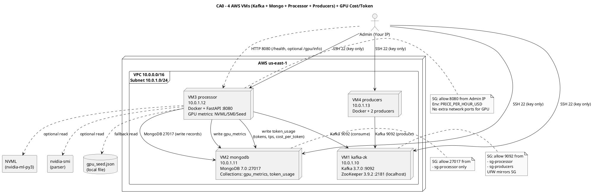

# CA0 – Manual Deployment on 4 VMs with GPU Cost/Token Use Case

Context
- Manually provision 3–4 VMs, install services, wire the pipeline, secure ports, and validate end-to-end.
- Chosen cloud: AWS (t3a.medium x4) or equivalent VMs. Local setups acceptable; topology remains identical.

Diagram (PlantUML)
![PlantUML](https://www.plantuml.com/plantuml/svg/XLDXRzis4FtENt7BbzbOPLkoiIJ-C3HptCJet0bHacA30OEMQ5iJnHD8AfutzB_lI2cHWxKD35WYx-cHz-wzzyPoRUjIiX_iNfG2dlADvieocrifO7OrWW0cSFKvWSUbWTv7lYqu_0HBL3kaPwmn5SQWRjwpEXNQz6bn4p_038qTtcCX56Eco5N5DI_1x7c6XrpjOCkb4IUL4XMcUusb0AlhqqgAPOLAA9lOenIWHMgvsad164yjQZYxoifSGUyFh3KiuluPS0D-Zp65cI00TL2RG71ZW_0C_cK0MsAcocCyWt0qyBzX-FDA9VL62TliXRGNJJmTuVnd00tZupA4miaH_5EiL8iEHolLQ3GUd0z6CBqSNKOhzIVYHo4geMdxSX31D0elGkX9JBdSaqhDXOdn5Ny4fPCvstJquKfvwQz_1KyVdO_2yvMQePIaIOxAJ65NrUjIM9sdvXrO9_-wDdmdsZEYLsUCeNeUONSAtVWQqqAugNuWnQxY1KmlHXVKd9jhIpw5Ju_BtuR9SZ5CXCXQ-l4h-WbKpwxewCSdz547Q0acHF25VM7iHsYcobDtFzOiWk0NSCfF8Kbk8OgWLuWZe9B7_Yj4z2PY_2PYyXt4OF3CSNj_7uCJ1th3lU3Ixjy1LcuMNCAGXZ7CrHRxhfyuhuJCbO13hYa0p1tHDTJunXa6UgqeVOAClm59KPcwx21jqy_syCw0ta7drWS6TMRy9Kuc25nba295WgmPUAkmbwZ1cHllIlNKKvxbF2XbK1t7ZLDTvHJPGaoP4vuYQuHkW6GEbd7BDzoG7vmpZH3Pu2-3Yf3U_x3DfMZHy_ary_sGlFuGc7PQQi6pbo8HVxj6D5JSSYatF2swOgUIb-KqAL-jduI7RkjNBb8L_JdLrgJQskzwOHEHrlJP4RXIQBbF8rFevCztUmkuzGbFRgP0DyD3CyUjnf85O7R1In1VbaqksCE7pr3cMgCcYMwOK1auMlO_ygWZR-R_DNPlu--GZ3iIRslFqKPn4REvUff2VBUOpTVn_6vz-_l3tVeXkMQV4CJVLdDGmXvG5r2XjWQsg9tZklFUqrjToly0)

Replication (high-level)
- Provision 4 VMs (≈2 vCPU, 4 GB) in one subnet.
- Secure SSH (PasswordAuthentication no; key-only), ufw mirror SGs.
- Install Kafka+ZooKeeper on VM1 (systemd), MongoDB on VM2, Docker on VM3/VM4.
- Run processor container on VM3 (Kafka consumer, reads GPU metrics or seed JSON, computes cost_per_token, writes to MongoDB).
- Run 1–2 producer containers on VM4 (publish token events to Kafka).
- Verify: produce → topic → processor → MongoDB documents (gpu_metrics, token_usage).
