# CA1 — Infrastructure-as-Code POC (Terraform + Docker Compose)

> **POC Goal:** Recreate the CA0 4-VM pipeline (Producers → Kafka → Processor → MongoDB) with **Terraform-managed** infrastructure and **cloud-init** bootstraps, plus one-command bring-up/tear-down and an **end-to-end verifier**.

**Repo pointers**

* High-level context & decisions: *Conversation summary for CA1*.
* Assignment framing & diagrams: *CA1 – Infrastructure as Code (IaC) Rebuild of CA0*
* CA0 quick-start (for parity reference): *CA0 — 4-VM Manual Deployment (cleaned)*

---

## TL;DR (grader fast-path)

```bash
# From ca1/terraform
make deploy            # terraform init/plan/apply (provisions VPC/SGs/EC2 + cloud-init bootstraps)

make verify        # runs verify-kafka, verify-mongo, verify-processor, verify-workflow (E2E)

make verify-workflow # runs through the workflow to emit events and verify Mongo counts

make down              # terraform destroy (complete teardown)
```

**Expected**: `verify-workflow` prints a final ✅ banner and shows Mongo counts increasing after producer run.

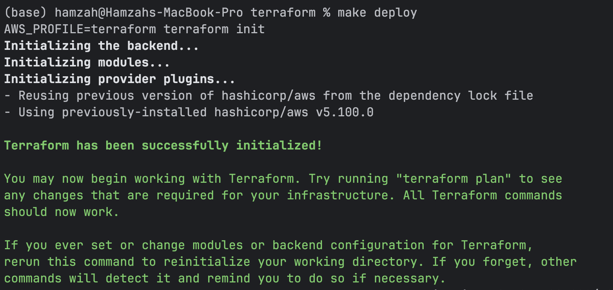

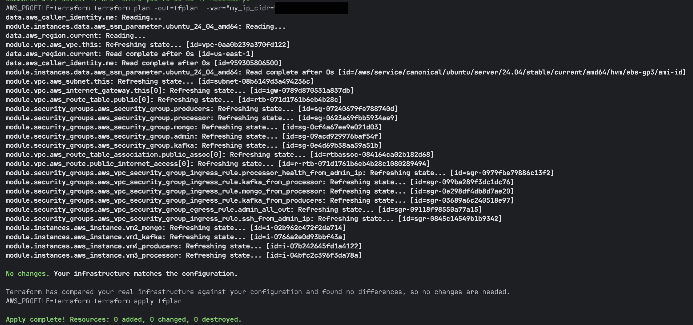

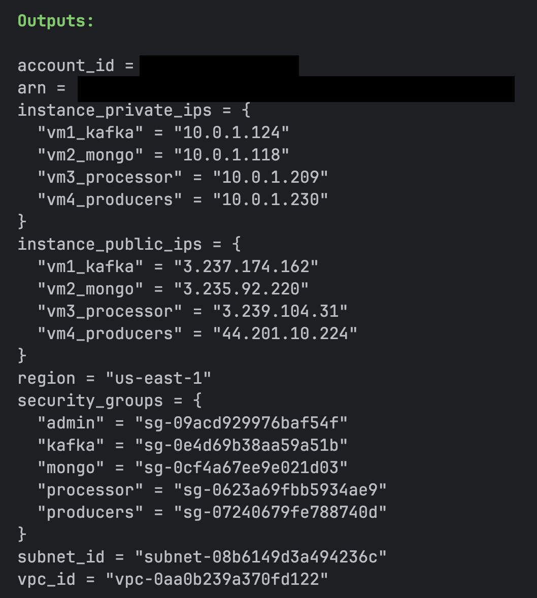

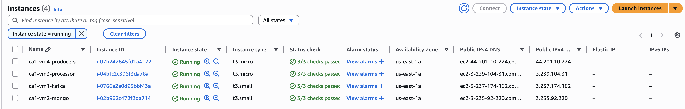

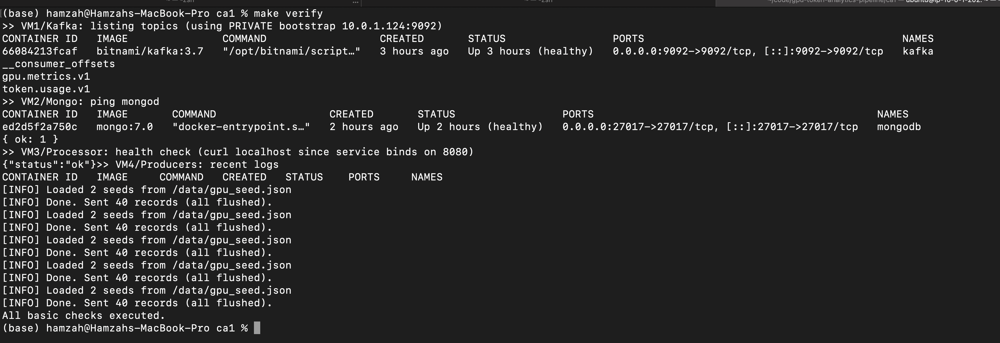

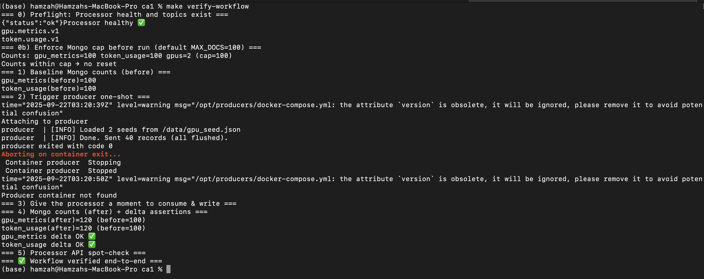

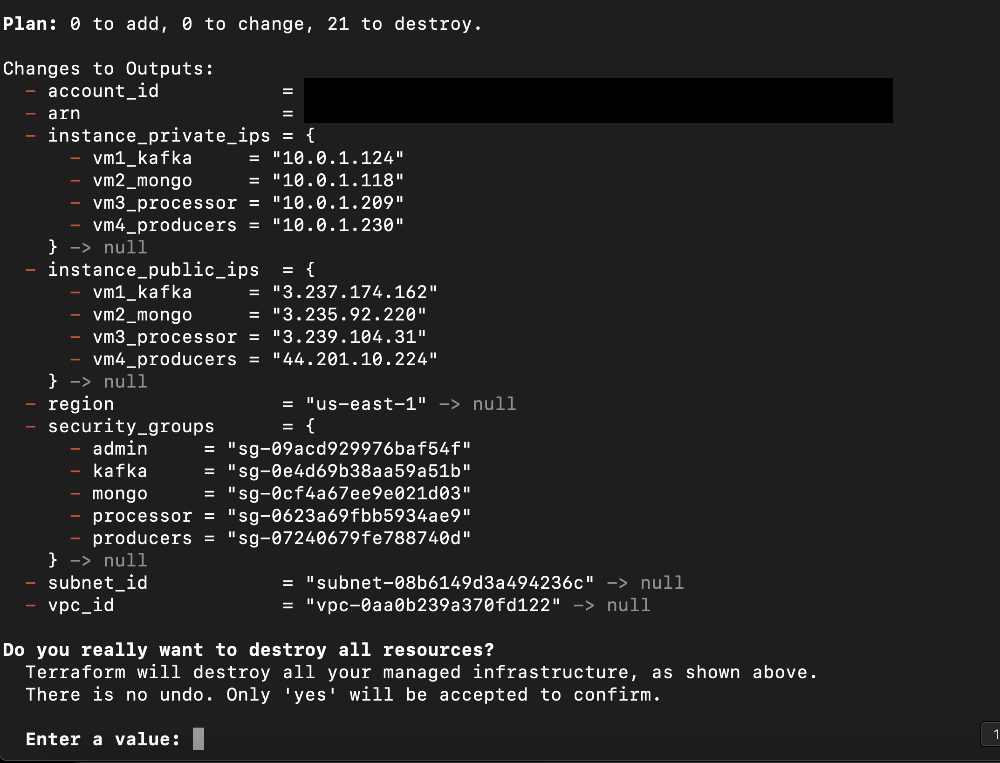
---

## Architecture (what gets built)

* **VM1:** Kafka 3.7 (KRaft). Docker Compose; advertised listener bound to VM1 private IP; topics created idempotently.
* **VM2:** MongoDB 7.x. Docker Compose; named volume; indexes + GPU seed data on first boot; healthcheck.
* **VM3:** Processor (FastAPI + Uvicorn + confluent-kafka + pymongo). Built **from Git subdir** on boot; exposes `/health` and `/gpu/info`.
* **VM4:** Producers (Python + confluent-kafka). Built **from Git subdir** on boot; **one-shot** sender with deterministic batch.

### Architecture diagram
![PlantUML-architecture](https://www.plantuml.com/plantuml/svg/bLPlR-BE4NxlJp7AxqM9hZROv7ftw8YE0Cb5EGB2a5HjAhIn1zXYxrgxw-IYzgH-Xtx3VfBEhWc6b4Rw9KhadNrczl6pyyVVj67Ab7dc6MuoX7ulXF_ywzymGwNOKgeSFi109XjK_YLNsa1F9MjkC36bGcXCcEBc1PwvMPDh2mfUOCO5ddgUtd1HCCLoq6kMocSkLh1acSQzdKJcXHGeJ6nUCWH5OPbOPVkGPyMAUvvI_2XgxTbJNB8oCpFyQNePNucSea26IxE74J95ZGMqF-uP5HCRQupsZJsbv7DVPbB1RsVkv-tcRCsJZK2j8Gn2pyjmXIAj3knsuKUrx7Qzhr_Dyloyri_FcM0hJ46XbgLAa12f4vHGbRBDlfL1umwgKJtn11lwr8jbnbDWbe66BgXI69uZfCmmM6RosHimlSOzn3NhDn-bDDgGSCsIGlaMx3csZgNdiSH81IT3iU82KK6Zb-PSmFNaz0IO1hVol88b6w839tKkJ9JyEztH2Vp3W_gsu2INQPbXy5GaBi1eF5ZSJVfGQN4KgZ4fRUeiLagMXTwvnLVlUN6XoP9WZR--ZMT7FHJcqY0GdlutP66u52mxhG-QzMP3xvVdKP8Gl7SVGwFKFZ9j_B22aSszw9AIW23sZS9Mu7wRuP_Wdn2NZm9DPGp969qvFm8wFu0gzjqeX0rRRjY3s4B3LWMaZGe8TId0oOt5GZlu5BIWSJDbItFw82PI6Ts1BwqlqOEOoO8dklCWV5WLPP2ZKRGEda9hCNA38YWrtHrPt44tlSkR7jI9vyxyTK0nWboAbKmVQvALBstjIDfCUcIQ74OMFBW0uXZyV123YmuahFKWg8OoJApOEtgBBRqTjuNZjhs9swln-yJQK2X9Lwwbggb5MshjO_fTqXts9jT0o32Y_ZMdOf9AqBfD39jhP9bPG-TpwpCjXxTtZgYJQ74n7i_YsRGtwUvkgbD9xbTS5_FfZ-vMgKwpkPEg4trgXP-QJWCV9jFh_d0n6KuNtyVpwM8U3xgjuFD7ktKrcIz6mna1uaLCc_rXLoEczdt8RTmVnl5u-huYPrQHj4nGwLgHzbQHisEAJ5xCMWfAAQT78iKoAsd3Tra9KK3CXZatloEZYEfWtXzEuoDKwU-m5lMgEibvnbStHmkMG4xNBMZq_q2xRDW29-y0Av5UWTDN9F7xmzw4KvWnbx5hNcZljNdv_hcjPA_gIcv9r0-NeyFbvCrowkrQb8is2jyQehU6zbl3cUKQRxibk6u9N1WKHaE3Pgf2JMF2lPt_rzze-VB7r8s4lrNkq84u_WvH14ibStZjzDO3ZdgqoSEMnY7-GHo9C3eU8Q88hXmgX_qxEnhcvdYO4AfszxzHA8Vtx_T8KD9iy3eYeR6TcgTUdRKaxhOhTc1I1QhIl4df3_Zaz7MbxzLLkU_KbqANEJdPLdmSMZKtYaySkJRxlH0-xBT2gBg7v-WxrpfG1ww6CpXeMlRjBbv7l9TaiapXP3VfeU4iFXVSpWqVhktGpBBjnmQTlFtSi7kNQ98rA2oa_NnhterWARFKQUf3MZaa5HmeyVmK2bHqDtRxNd634A1uWYNFqBdq5JAp4wL1b-WeZBVZjmFpotl8kL9IKO5KbJaVr3aV1ETsFH-u9tAl7wFwiLq_Kda8E-SVfJ4o1xbqJWSJD4vOPfjSs2OkRfn2RZjfGqZuYvGtYFHEjCNI9rI6Qqo3ZAuB1SdGdVpeNT_EXd-UKRC_70dkYygUVOH1vBsPZwy201Sf_aJjfcMmbn0DeplXwLxCR_HeFyl_2m00)

### Provisioning Sequence diagram
![PlantUML-Sequence](https://www.plantuml.com/plantuml/svg/dPNDRk984CVlVehIx0Mq69iFAHbsDnhYaDc8P41y99T8gCTkS0kxo-ekXsHFUze7s7t3UP8j6yPuHZw52-wkVrN_wjzb-6H96ChJn255YOHWt8DlV_y7AscCsA99OPnboHjy--TVkC5mBmq4c6Pe9LmZaYKZCcZDUVlneUquTgzq9en8mSOYmeFIEzYAnCfQ94MDOMmmbK0chqV6nk0Xm0GD_38iFpy7Lx4AzrfQ2xrkhnOyCCQJYYY6lk_NpnAl3wmMExbKVqdeNVgE8q920nEzKreojx0mSLXDAbIPq0GVphq7ztSV2i7gzaV5-6a9u_anniy_1YT1dyteFUkzsEv5gU5bawR_hDcC7KPVJwf-ashmh3E38RU1vgGRDEc6fIxAGsdiIJTqd0cuLym_0ggwKbfHqtwM20sjntdGWULdsu4XS67-pgqqRYH8j9koH3aVhiW9NNus-2ATrIth2cT641WfI09NzPRvLot9Ms1EqZPe-51ebQPvfIrUrRPNDTQkvzsBN8TnGGajjhZRvOxRS50KdvcX5IQOHsxHD0yevnNfh1x1v5M6Z5BNdaRyr-z3_Xji9V4HmTZtNjAUMzAr7KwlgaJ7bF2O07a6RWIjQI64GVUYwyDq8RRKVjQdDWap5TeHxBAycqeolEY-z3gylvUwcnV3okiQQlyTg7stjB10xLTLcb4V2k7DDJ1gzvKnxzWfu7KeVAwE6IdK8W6b8_agROrhy0wkWLjTQi4sg2erizqAI_oYUUiN5QBHCBhqBtrcd7nv7C5qV3iTRwvdizLojHZFE_0m-_9vjbalxZimNzm5ayryijZyELilDklbJGry-0xmeLkRGIvHLMe6dxzHZ1g-vxHicwbNAfN62mtgiwrRD919ep1I8SXKaNNEvNcyviSAG0YZZ_v7ddGwu6c6QWwoCa1jyrJ2rc1wr9x3VFbFHj6nJF_2xrquayhwC3S9n4JPoFD-vokwAbtsOYaIYk6Fg-8t5MRJffSVSyfoWjRTt7PWlRXZf2PP92qPV6DsAKo41ysoJr97nV_E_m00)

For deeper context and the design timeline, see the [conversation summary](./docs/conversation-summary.md) and [architecture readme](./docs/architecture.md).

---

## How to validate (evidence for each requirement)

### 1) **IaC provisioning** (idempotent & parameterized)

* **What to run:** `make deploy`

* **Output:**

    * Apply plan summary with created resources (VPC/SGs/EC2).
    * Output JSON of computed endpoints:

      ```bash
      terraform output -json > ../docs/outputs.json
      ```

* **Meets requirement:** Code-driven infra, no console clicking; repeatable bring-up.
  (See assignment framing & diagrams.)

---

### 2) **Kafka up with topics**

* **What to run:** `make verify-kafka`

* **Output:**

 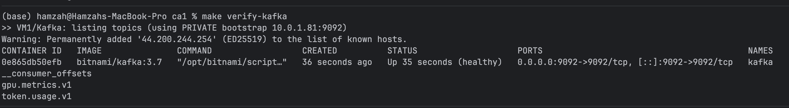

* **Meets requirement:** Messaging layer provisioned with expected topics; advertised listener via private IP.
  (Decisions & fixes captured in CA1 summary.)

---

### 3) **Mongo up with indexes + seed**

* **What to run:** `make verify-mongo`

* **Output:**

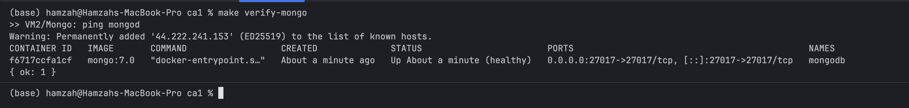

* **Meets requirement:** Persistent store with initial data and indexes; healthcheck & named volume.
  (See Mongo template notes in CA1 summary.)

---

### 4) **Processor running & API reachable**

* **What to run:** `make verify-processor` (or `verify-processor-expanded`)

* **Output:**

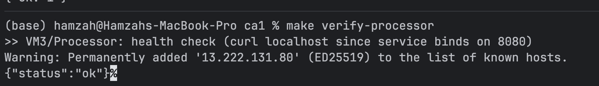

* **Meets requirement:** App layer consumes Kafka and writes to Mongo with a simple API.
  (See processor image & health decisions.)

---

### 5) **Producers trigger + end-to-end**

* **What to run:** `make verify-workflow`

* **What it does:** Baselines Mongo counts → triggers producer → asserts deltas → checks `/gpu/info` → prints final banner.

* **Output:**

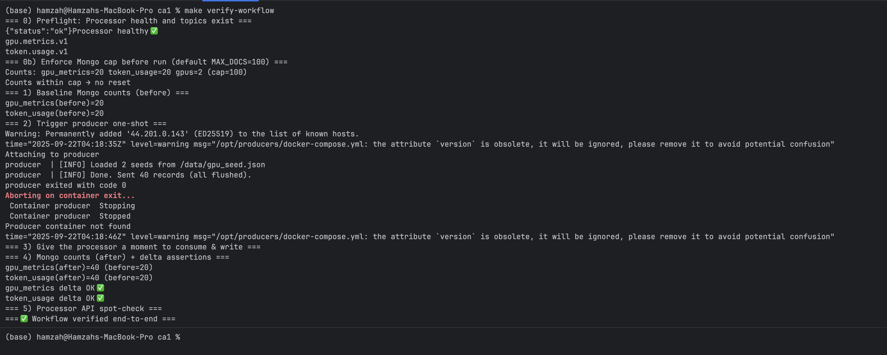

* **Meets requirement:** Demonstrable POC from producer input to DB output via processor.
  (End-to-end verifier captured in CA1 summary.)

---

### 6) **One-command teardown**

* **What to run:** `make down`

* **Output:** Destroy summary.

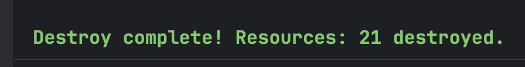

* **Meets requirement:** Code-controlled teardown with no orphaned resources.
  (Assignment framing.)

---

## Parameterization (showing no hard-coded environment values)

Where values come from:

* **Instance IPs & endpoints:** resolved at apply time (Terraform) and/or at boot via **IMDS** (cloud-init), then injected into Compose or `.env`.
* **Topic names, DB name, batch size, image tags:** provided via **Terraform variables** with sensible defaults (override in `*.tfvars`).
* **Build contexts:** VM3/VM4 images are built **from Git subdirectories** (no rsync; source-of-truth parity).

This satisfies the “no hardcoded environment values” aspect of the rubric for infra/application configuration. (Kafka/Mongo endpoints, API ports, and topics are parameterized.)

---

## Security & secrets posture (current vs stretch)

**Current POC (implemented):**

* The stack **does not embed static secrets** in code or templates.
* Terraform runs from a developer shell where **AWS credentials come from your `.zshrc` profile** tied to your IAM user/role; cloud resources are provisioned using those *ephemeral CLI credentials*.
* The application path avoids DB credentials by **not enabling Mongo auth** for this POC. (If you turned auth on, you would need to supply credentials.)

**Why this still demonstrates “no hardcoded secrets”:**

* All runtime parameters (IPs, ports, topics, DB name, image tags) are passed via variables and boot-time discovery, **not** inlined secrets.
* There is no requirement in the POC to distribute app secrets to VMs (no passwords shipped via user-data).

**Stretch (recommended for production / extra credit):**

* Introduce **AWS Secrets Manager or SSM Parameter Store** + EC2 **instance profiles** to fetch DB credentials at boot (VM2 to create users; VM3 to use app creds).
* This adds rotation/audit and keeps secrets off disk/config. Guidance is outlined in the CA1 discussion notes (not implemented here by design).

---

## Mapping table — Requirement → How it’s met

| Requirement                                    | How it’s met                                                     |
| ---------------------------------------------- | ---------------------------------------------------------------- |
| Code-defined infra (IaC)                       | Terraform modules for VPC/SG/EC2; cloud-init bootstraps services |
| Parameterized config (no hardcoded env values) | TF variables/locals → templates; IMDS on boot; Git-based builds  |
| Kafka operational with topics                  | VM1 Compose + topic creation idempotent                          |
| Mongo operational with schema/seed             | VM2 init scripts create indexes + seed                           |
| Processor service + API                        | VM3 health (`/health`), data API (`/gpu/info`)                   |
| Producers → Kafka                              | One-shot run; logs show sends/flushed                            |
| End-to-end proof                               | `make verify-workflow` baseline → trigger → delta                |

---

## Troubleshooting quick hits

* **“input device is not a TTY”** in SSH execs → remove `-t` for non-interactive commands (use none or `-i`).
* **Processor unhealthy on slim image** → prefer wget/Python/TCP healthchecks over `curl`.
* **Mongo connection refused from VM3** → ensure SG allows **processor → mongo 27017**.
* **Kafka permission/health loops** → ensure Kafka data dir ownership (Bitnami UID 1001).

---

### Appendix — Commands the grader can paste

```bash
# Show current outputs
terraform output

# Show Kafka topics on VM1
make exec-vm1 CMD='docker exec -i kafka kafka-topics.sh --list --bootstrap-server localhost:9092'

# Check Mongo indexes & counts on VM2
make exec-vm2 CMD='docker exec -i mongodb mongosh --quiet --eval "db.getSiblingDB(\"ca1\").gpu_metrics.getIndexes(); db.getSiblingDB(\"ca1\").gpus.count();"'

# Processor health + sample data
make exec-vm3 CMD='curl -sf http://localhost:8080/health && echo && curl -sf http://localhost:8080/gpu/info'

# Trigger producer
make trigger-producers
```

> This README is designed to be self-contained for grading and cross-linked to the project documentation you’ve already built.
