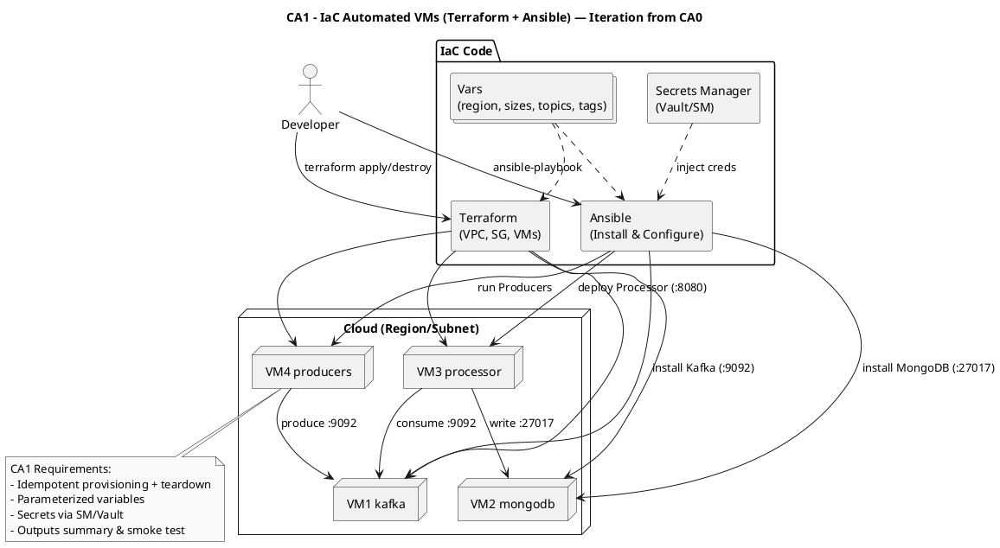

# CA1 – Infrastructure as Code (IaC) Rebuild of CA0

Context
- Recreate CA0 via code (Terraform/Ansible/etc.), idempotent, parameterized, secure secrets, and one-command deploy/destroy.
- Pipeline unchanged: Producers → Kafka → Processor → MongoDB (same as CA0), but fully automated.

Diagram (PlantUML)

Replication (high-level)
- make deploy → provisions VMs and installs components; make test → smoke test; make destroy → teardown.
