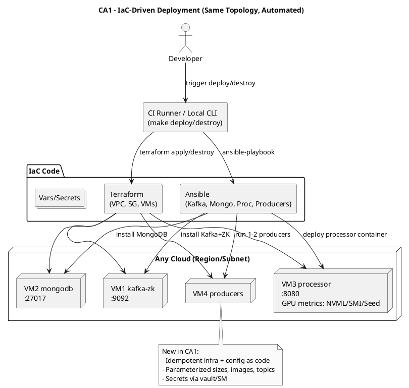

# CA1 – Infrastructure as Code (IaC) Rebuild of CA0

Context
- Idempotent provisioning and configuration via code with parameters and secret management.

Diagram (PlantUML)

Replication (high-level)
- make deploy → make test → make destroy.