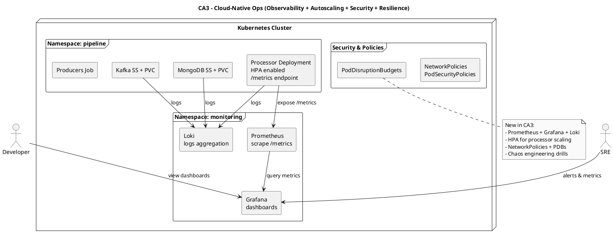

# CA3 – Cloud-Native Ops (Observability, Autoscaling, Security, Resilience)

Context
- Enhance CA2 with ops features and resilience tests.

Diagram (PlantUML)

Replication (high-level)
- Deploy monitoring stack; configure HPA and policies; run chaos experiments.