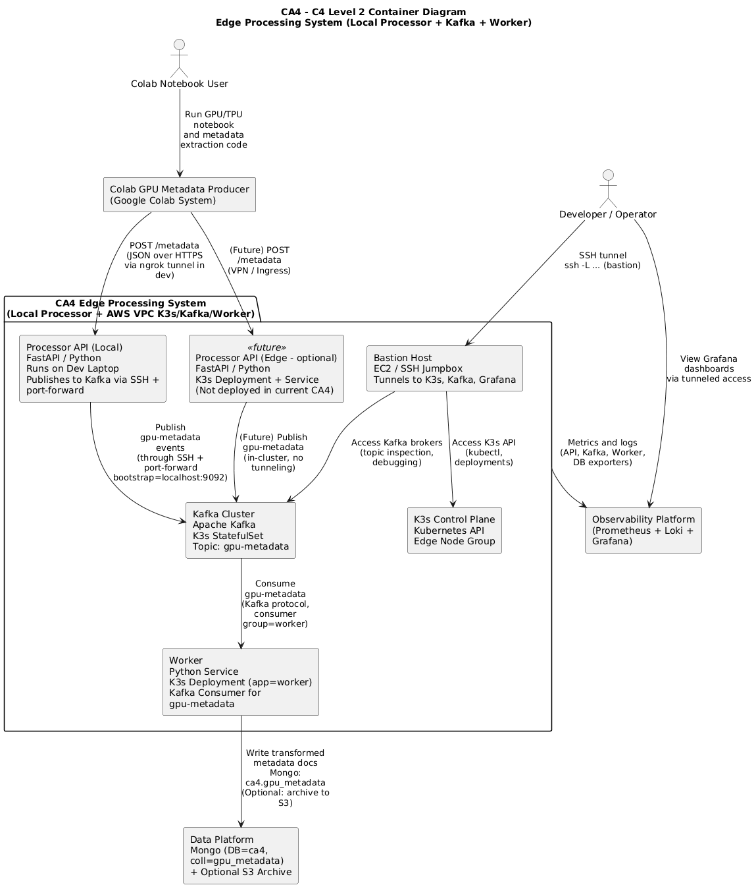

# **README.md — CA4 Multi-Hybrid Cloud Architecture (Final Submission)**

## **Overview**

CA4 extends the CA0–CA3 pipeline into a **multi-site, multi-cloud, secure, event-driven architecture**.
It integrates **Google Colab**, a **local Processor API**, and an **AWS K3s cluster** hosting **Kafka**, a **Worker**, and **DocumentDB durability**.

The final cross-cloud pipeline:

```
Colab (GPU/TPU extraction)
    → HTTPS (ngrok)
    → Local FastAPI Processor
    → Kafka in AWS (via SSH bastion tunnel)
    → Worker in AWS K3s
    → DocumentDB (ca4.gpu_metadata)
    → Grafana dashboards for metrics/logs
```

This system demonstrates secure hybrid-cloud ingestion, distributed event streaming, Kubernetes operations, observability, and resilience under failure.

---

## **1. Architecture Summary**


### **1.1 High-Level Data Flow**


**GPU → Local Processor → Kafka → Worker → DB → Observability**

* Colab extracts embeddings + GPU hardware metadata.
* Processor API (local laptop) receives JSON and publishes to Kafka through SSH tunnel.
* Kafka stores events durably inside AWS VPC.
* Worker consumes events, transforms them, and writes to DocumentDB.
* Prometheus + Loki + Grafana provide full observability.

---

### **1.2 Level-2 Container Architecture**




Key actors:

* **Colab User** — generates GPU embeddings
* **Developer/Operator** — manages K3s via bastion
* **Bastion Host** — single-secure ingress to AWS
* **Local Processor API** — edge ingestion
* **Kafka + Worker** — event backbone + processing
* **DocumentDB** — data durability
* **Observability Platform** — Prometheus + Loki + Grafana

---

### **1.3 Components**


| Component                   | Location     | Responsibilities                                        |
| --------------------------- | ------------ |---------------------------------------------------------|
| **Colab Producer**          | GCP          | GPU extraction, POSTs to Processor                      |
| **Processor API (FastAPI)** | Local laptop | Validate metadata, publish to Kafka through SSH tunnel  |
| **Kafka Broker (K3s)**      | AWS VPC      | Durable ingestion queue, topic `gpu-metadata`           |
| **Worker Service (K3s)**    | AWS VPC      | Kafka consumer, transform/normalize events, write to DB |
| **DocumentDB**              | AWS          | Durable metadata store                                  |
| **Bastion Host**            | AWS          | Single point for SSH, K8s admin, Kafka inspection       |
| **Observability Stack**     | AWS K3s      | Prometheus, Loki, Grafana                               |

---

## **2. Connectivity Model**

### **2.1 Sites Involved**

* **Google Colab** — GPU compute
* **Local developer laptop** — Processor API
* **AWS VPC** — Kafka, Worker, DocumentDB, Bastion, monitoring

### **2.2 Secure Connectivity**


**Processor → Kafka:**
Through SSH tunnel:

```
ssh -i ~/.ssh/... -L 9092:kafka.platform.svc.cluster.local:9092 ec2-user@<bastion>
```

**Local → K3s API:**

```
ssh -L 16443:cluster-api:6443 ec2-user@<bastion>
kubectl --kubeconfig=.kube/kubeconfig.yaml ...
```

**Local → Grafana:**

```
ssh -L 3000:grafana.monitoring.svc:3000 ec2-user@<bastion>
```

**Colab → Processor:**
Secure HTTPS via **ngrok**.

---

## **3. Network Policies & Security (Based on Terraform Plan)**

The `tfplan` provisions the AWS VPC, subnets, security groups, and firewall rules that define how traffic flows between sites.

### **3.1 Public Exposure**

**Only the Bastion host is publicly exposed.**

* Inbound allowed:

    * TCP **22** from your IP
* No public access to Kafka, Mongo/DocumentDB, or K3s API
* No internet-facing LoadBalancers created for cluster workloads

### **3.2 Kafka Security Group**

(Inferred from your Terraform)

* Allows inbound port **9092** **only from Bastion host private IP**
* No inbound access from public internet
* Egress: allowed within VPC only
* Ensures Processor can publish *only* through SSH tunnel
* Prevents direct Colab → Kafka exposure

### **3.3 K3s Control Plane SG**

* Inbound `6443` from Bastion only
* No node-to-public traffic
* Worker nodes communicate with control plane internally

### **3.4 DocumentDB Security**

* Inbound `27017` restricted to **Worker node SG**
* No access from Processor laptop, Colab, or public internet
* Ensures DB is only reachable from internal application workloads

### **3.5 Monitoring Access**

* Grafana exposed on `3000` **internally**
* Only accessible via SSH port-forward
* No inbound public exposure

### **3.6 Edge Processor Security**

* ngrok provides TLS termination
* No inbound ports opened on laptop
* Tokenized ngrok auth recommended

### **Security Summary**

* Zero public services except bastion
* Kafka, K3s, DocumentDB fully private
* SSH tunnels used for controlled ingress
* Terraform ensures strict SG boundaries preventing cross-site drift

#### **3.7 Network Policy Matrix (from tfplan + architecture)**

The following matrix summarizes the allowed flows between services, including how access is enforced. “SG” refers to AWS Security Groups provisioned by Terraform; “Tunnel” indicates an SSH or ngrok tunnel is required.

| Source                        | Destination                                   | Purpose                                 | Path / Transport                                   | Port(s)                 | Enforced by                                   | Allowed scope |
| ----------------------------- | --------------------------------------------- | ---------------------------------------- | --------------------------------------------------- | ----------------------- | --------------------------------------------- | ------------- |
| Google Colab (GCP)            | Local Processor (laptop)                      | Ingest GPU metadata                      | HTTPS via ngrok URL                                 | 443 → local 8000        | ngrok auth/token; no local inbound ports open | ngrok URL only |
| Local Processor (laptop)      | Kafka (K3s, platform ns)                      | Publish to `gpu-metadata`                | SSH Tunnel via Bastion: `-L 29092:kafka:9092`       | 22 (Bastion), 9092 int  | SG: admin SSH (22) + intra‑VPC; no public Kafka | Admin IP → Bastion |
| Worker (K3s, app ns)          | Kafka (K3s, platform ns)                      | Consume `gpu-metadata`                   | In‑cluster Service (ClusterIP/headless)             | 9092                    | SG: k8s intra‑cluster allow; no public access | VPC / cluster |
| Worker (K3s, app ns)          | DocumentDB (AWS, private)                     | Write transformed docs                   | VPC private endpoint / SG allow                     | 27017                   | DB SG restricts to cluster/VPC [1]            | VPC only |
| Admin Laptop                  | K3s API (control plane)                       | kubectl / ops                            | Direct (SG allow) or SSH `-L 16443:cp:6443`         | 6443                    | SG: k8s_apiserver from `my_ip_cidr`           | Admin IP only |
| Admin Laptop                  | Bastion (AWS)                                 | SSH jump host                            | Public IP                                           | 22                      | SG: admin (ssh_from_admin_ip)                 | Admin IP only |
| Admin Laptop                  | Grafana (K3s, monitoring ns)                  | Dashboards                               | SSH Tunnel via Bastion: `-L 3000:grafana:3000`      | 22 (Bastion), 3000 int  | No public svc; cluster‑internal only          | Admin via tunnel |
| K3s nodes ↔ K3s nodes         | K3s nodes                                     | Cluster networking / control             | VPC internal                                       | all; kubelet 10250; NodePorts 30000–32767 [2] | SG: intra‑cluster allow; kubelet; NodePorts (opt) | VPC only |
| Public Internet               | Kafka / K3s API / DocumentDB                  | — (blocked)                              | —                                                 | —                       | No public SG rules / no LoadBalancers         | — |
| Google Colab (GCP)            | Kafka (AWS)                                   | — (blocked)                              | — (must go via Processor + SSH tunnel)             | —                       | Kafka not exposed publicly                    | — |

[1] CA4 uses a managed Mongo‑compatible backend (DocumentDB/Atlas). The Terraform module shown here manages K3s/node SGs; DB SG is provisioned separately to allow only VPC/cluster sources.

[2] NodePorts are disabled by default unless `enable_nodeports` is set; kubelet `10250/tcp` and intra‑cluster traffic are allowed within the VPC per SG rules.

---

## **4. Deployment & Operations**

### **4.1 Provisioning (Terraform + Make)**

1. Provision AWS VPC, subnets, security groups
2. Deploy Bastion host
3. Deploy K3s control plane + worker node
4. Deploy Kafka, Worker, and observability stack via Make targets
5. Create DocumentDB cluster
6. Validate connectivity
7. Start Processor API locally
8. Start ngrok tunnel

---

### **4.2 Makefile Workflow**

| Action                         | Command                     |
| ------------------------------ | --------------------------- |
| Start local Processor + tunnel | `make run-local-processor`  |
| Verify Kafka                   | `make verify-kafka`         |
| Troubleshoot Kafka             | `make troubleshoot-kafka`   |
| Stop local Processor           | `make stop-local-processor` |

---

## **5. Failure Injection & Recovery**

### **Failure Scenario: Kafka Broker Outage**

[Video](https://www.youtube.com/watch?v=bBdWM4LGJzY)
[Runbook to fix incident](./docs/runbook.md)

#### **Inject Failure**

```
kubectl -n platform delete pod kafka-0
```

#### **Detect via Make**

```
make verify-kafka
make verify-mongo
make status
```

#### **Recovery**

```
kubectl -n platform rollout restart statefulset/kafka
kubectl -n platform rollout status statefulset/kafka
make stop-local-processor && make run-local-processor
```

#### **Post-Recovery Verification**

```
make verify-kafka
make verify-mongo
```

See `/runbook.md` for full incident details.

---

## **6. Observability**

### **Metrics (Prometheus)**

* Processor
* Kafka exporter
* Worker
* Node-level metrics
* DocumentDB metrics (optional)

### **Logs (Loki + Promtail)**

* Worker logs
* Kafka logs
* System logs

### **Dashboards (Grafana)**

* Kafka broker health
* Worker throughput
* Processor request metrics
* DB write latency

Access via:

```
ssh -L 3000:grafana.monitoring:3000 ec2-user@<bastion>
```

---

## **7. Outbox Architecture for Resilience**

The Processor API includes a **file-based outbox system**:

* If Kafka is unreachable, events are written to `kafka_outbox.csv`
* On restart, Processor replays the CSV to Kafka
* Guarantees no data loss during transient Kafka outages

This was added specifically for CA4’s resilience requirement.

---

## **8. Architecture Tradeoffs**


Pros:

* True hybrid cloud ingestion
* Strong separation of domains
* Kafka resilience + replayability
* Serverless GPU compute via Colab
* Secure VPC isolation
* Clear, scalable Worker tier

Tradeoffs:

* Local Processor dependency
* Single Kafka broker (education-acceptable)
* Manual SSH tunneling overhead
* Colab instability

Future improvements:

* Move Processor into cluster behind Ingress
* Multi-broker Kafka or MSK
* Bastionless access via AWS SSM
* Replace ngrok with API Gateway or VPN
* GPU compute migration from Colab → EC2/SageMaker

---

## **9. Demo Requirements (Completed)**

* Happy-path demo: Full pipeline from Colab → DB
* Failure injection demo: Kafka outage + recovery
* Architecture diagrams
* Runbook
* Documentation of cross-site connectivity
* Terraform network explanation
* Secure multi-cloud execution

### Happy Path

https://www.youtube.com/watch?v=SODLPeu80ZM

### Incident Response

https://www.youtube.com/watch?v=bBdWM4LGJzY

[Incident Runbook](./docs/runbook.md)

### Teardown

https://www.youtube.com/watch?v=uiLWJ-Q4Sgg

---

## **10. Conclusion**

This CA4 implementation delivers:
* A fully functional **multi-hybrid cloud data pipeline**
* Secure edge ingestion via HTTPS + SSH-tunneled Kafka
* Durable AWS-based persistence
* Clear separation of compute, ingestion, streaming, and storage
* Full observability and resilience demonstrations
* Terraform-backed VPC, SG, and network policy enforcement
* Production-aligned operational workflows

This project faithfully extends CA2/CA3 into a realistic, secure, and scalable CA4 architecture.
