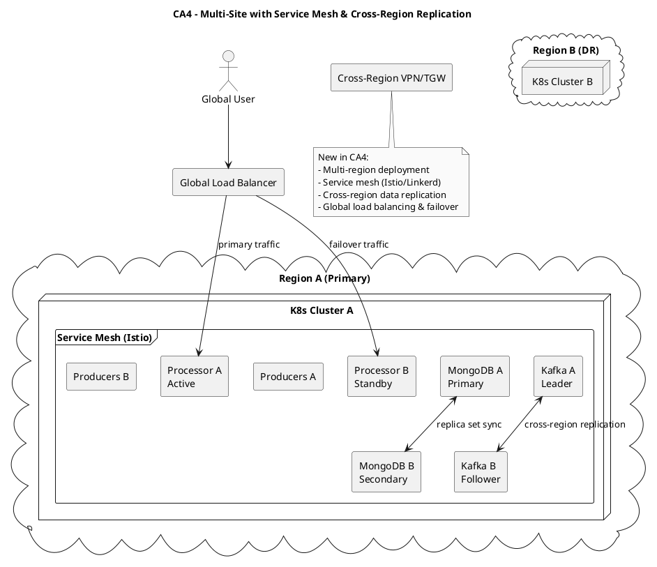

# CA4 – Multi-Site Connectivity & Advanced Networking

Context
- Scale to multiple regions with service mesh, cross-region replication, and disaster recovery.

Diagram (PlantUML)

Replication (high-level)
- Deploy multi-region clusters; configure service mesh; test cross-region failover.