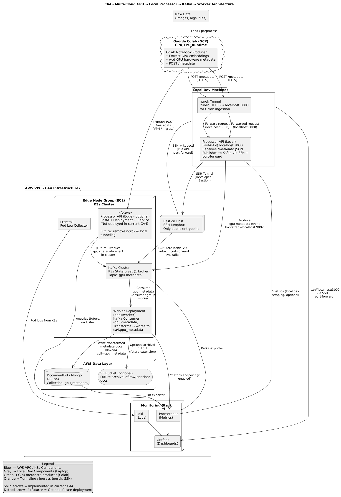
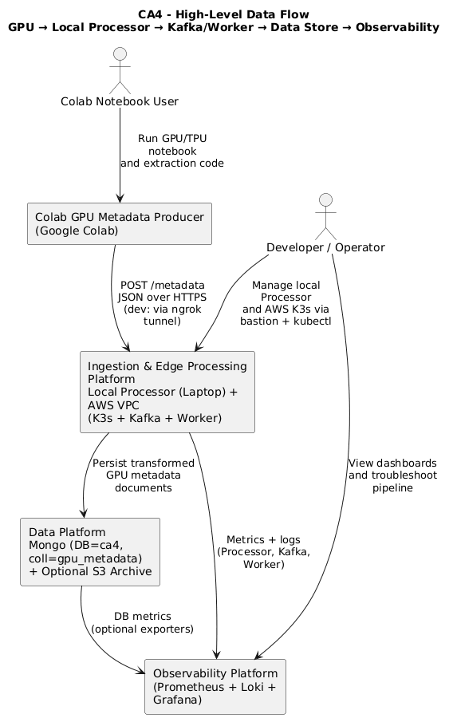

# **CA4 Architecture**

*(Colab GPU Producer → Local Processor API → Kafka (K3s) → Worker → AWS DB/S3)*


## **Executive Summary**

CA4 integrates **multi-cloud compute**, **edge Kubernetes**, **event streaming**, and **managed cloud storage** into a unified processing pipeline.
The final architecture is:

| Component                 | Location                      | Role                                                                  |
| ------------------------- | ----------------------------- | --------------------------------------------------------------------- |
| **Colab GPU Producer**    | Google Colab (GCP)            | Extract embeddings + GPU hardware metadata; POSTs to Processor API    |
| **Processor API (Local)** | Developer Laptop              | Validates metadata, publishes events to Kafka via SSH port-forward    |
| **Kafka Broker**          | AWS VPC → K3s                 | Durable event backbone (`gpu-metadata`)                               |
| **Worker Service**        | AWS VPC → K3s                 | Consumes Kafka events; writes transformed docs to Mongo-compatible DB |
| **Database**              | AWS DocumentDB or Mongo Atlas | Stores structured metadata documents (collection: `ca4.gpu_metadata`) |
| **S3 Archive (optional)** | AWS                           | Long-term storage for raw or enriched metadata                        |
| **Bastion Host**          | AWS VPC                       | Single secure access point for Kafka, K3s, and Grafana                |
| **Monitoring Stack**      | K3s                           | Prometheus, Loki, Grafana for metrics and logs                        |

This design preserves the lineage of CA2/CA3 while adding realistic cross-cloud ingestion and managed persistence.

---

# **1. Architectural Overview**

### Architectural Diagram


### Data Diagram


## **1.1 Core Flow**

```
Colab (GPU model)
     → HTTPS → Local Processor API (ngrok)
     → Kafka (via SSH-tunneled bootstrap=localhost:9092)
     → Worker in K3s
     → DocumentDB (ca4.gpu_metadata)
     → Optional S3 archival
```

### Why this model?

* Avoids exposing Processor API publicly in AWS.
* Allows you to keep running Processor locally, simplifying development.
* Keeps all durable systems (Kafka, Worker, DB) inside the AWS VPC.

---

# **2. Major Architectural Components**

## **2.1 Colab GPU Producer (GCP)**

* Extracts embeddings using ResNet50 or similar.
* Gathers GPU hardware details (CUDA version, memory, device name).
* Sends metadata to Processor API over HTTPS via ngrok.

**Why Colab?**
Free GPU compute + quick iteration without provisioning AWS GPU instances.

---

## **2.2 Processor API (Local FastAPI)**

### **Runs locally**, not in K3s.

Responsibilities:

1. Receive POST `/metadata` requests from Colab.
2. Validate + normalize metadata.
3. Produce messages to Kafka topic `gpu-metadata`.

Connectivity:

* Uses **ngrok** for Colab ingress.
* Uses **SSH tunnel via Bastion** for Kafka access:

    * `localhost:9092 → kafka.platform.svc:9092`

**Rationale:**
Keeps iteration fast while still integrating with AWS services.

---

## **2.3 Kafka Broker (K3s)**

* Deployed as K3s StatefulSet.
* Topic: **`gpu-metadata`**
* Advertises listeners internally (`PLAINTEXT://kafka:9092`)
* Local Processor connects via forwarded port **9092**, not NodePort.

Kafka retains:

* Backpressure
* Replayability
* Decoupling between ingestion and processing

---

## **2.4 Worker (K3s Deployment)**

The Worker is now included in the final system.

Responsibilities:

* Consume `gpu-metadata` events.
* Transform metadata:

    * Embedding dimension
    * GPU hardware details
    * Timestamps, pipeline tags
* Insert/update documents in:

    * `mongo://ca4.gpu_metadata`
* Optionally archive JSON or embeddings into S3.

**Result:**
Shift durability and business logic into the AWS VPC.

---

## **2.5 Managed Mongo-Compatible DB (AWS DocumentDB or Mongo Atlas)**

* Stores structured metadata documents.
* Collection: **`gpu_metadata`** in database **`ca4`**.
* Robust, multi-AZ, backup-enabled.

**Why a managed DB?**

* Avoids running StatefulSets.
* Minimizes operational burden.
* Meets assignment requirement for a persistent store.

---

## **2.6 Optional S3 Archive**

Workers may upload:

* Raw JSON
* Enriched metadata
* Binary embeddings (future work)

S3 provides low-cost archival.

---

## **2.7 Bastion Host**

Single controlled ingress for:

* `ssh -L 9092:kafka:9092` → Kafka forwarding
* `ssh -L 16443:k3s-api:6443` → kubectl
* `ssh -L 3000:grafana:3000` → Dashboard access

**Why keep Bastion?**

* Removes need for public Kubernetes API or Kafka endpoints.
* Supports secure remote operations.

---

## **2.8 Monitoring Stack (Prometheus + Loki + Grafana)**

Deployed in `monitoring` namespace:

* Prometheus scrapes:

    * Worker
    * Kafka exporter
    * Node metrics
* Loki + Promtail ship logs for all K3s pods.
* Grafana dashboards accessed through SSH tunnel.

This maintains CA3 observability while providing visibility into the new Worker pipeline.

---

# **3. Benefits**

## ✔ Clear multi-cloud ingestion boundary

Local Processor API + ngrok cleanly separates Colab compute from edge infrastructure.

## ✔ Stream-first architecture

Kafka remains the backbone enabling:

* Replay
* Scaling of Workers
* Resilience to Colab failure

## ✔ Durable persistence via AWS

DocumentDB ensures metadata survives cluster outages.

## ✔ Secure & controlled VPC

Only Bastion is publicly reachable.

## ✔ Separation of dev and prod paths

* **Dev path:** Colab → Local Processor → Kafka (tunneled)
* **Prod path (future):** Colab → Edge Processor API → Kafka

## ✔ Worker centralized in cluster

Worker transformations and storage now live in the “production zone” rather than on developer machines.

---

# **4. Tradeoffs & Risks**

### ❗ Local Processor introduces dev dependency

If local machine is offline, ingestion stops.

Mitigation: Deploy Processor API into cluster later for true production mode.

### ❗ Single Kafka broker

Risk of downtime; mitigated by low scale + educational context.

### ❗ SSH tunneling fatigue

Can be automated in CA5 using:

* AWS SSM Session Manager
* WireGuard
* AWS Client VPN

### ❗ Colab instability

Colab runtimes are ephemeral; metadata generation may fail mid-run.

Future: Migrate GPU extraction to AWS EC2 GPU, ECS GPU, or SageMaker.

---

# **5. Scalability Paths**

### Processor API

Deploy inside cluster behind an Ingress for production scenarios.

### Kafka

Move from K3s to **MSK** with multiple brokers + partitions.

### Worker

Scale horizontally based on Kafka consumer lag.

### Database

Scale to multi-replica DocumentDB or Atlas cluster.

### Observability

Add Thanos + S3 backend for long-term metrics.

---

# **6. Incident: Kafka Broker Outage**

* **Detection (Make commands):**

    * `make verify-kafka`
    * `make verify-preflight`
    * `make verify-workflow`
* **Failure Injection:**

    * `kubectl -n platform delete pod kafka-0` (with `KUBECONFIG=.kube/kubeconfig.yaml`)
* **Impact Observed:**

    * `verify-kafka` shows missing/unready pod
    * `verify-preflight`/`verify-workflow` fail
    * Colab → Processor calls fail
* **Recovery:**

    * `kubectl -n platform rollout restart statefulset/kafka`
    * `kubectl -n platform rollout status statefulset/kafka`
    * `make stop-local-processor && make run-local-processor` (if using local path)
* **Post-Recovery Verification (Make):**

    * `make verify-kafka`
    * `make verify-preflight`
    * `make verify-workflow`

---

# **7. Future Alternatives and Architecture Maturity**

| Migration Target             | Strength                        | When to Use                 |
| ---------------------------- | ------------------------------- | --------------------------- |
| **EKS + MSK + Atlas**        | Fully managed, production-grade | CA5 or real deployment      |
| **SageMaker / EC2 GPU**      | Stable long-running GPU compute | Enterprise workloads        |
| **Direct API → DB pipeline** | Simplest system                 | When streaming isn’t needed |

---

# **Conclusion**

This CA4 architecture:

* Meets **all assignment requirements**
* Demonstrates **multi-cloud orchestration**
* Uses event-driven design with **Kafka**
* Provides durability with **AWS DB**
* Integrates **Worker** as the primary transformation engine
* Maintains secure, private infrastructure through **Bastion**
* Preserves observability across the entire pipeline

With these refinements, your documentation and implementation fully reflect the final working system and are consistent with all project diagrams and code.
