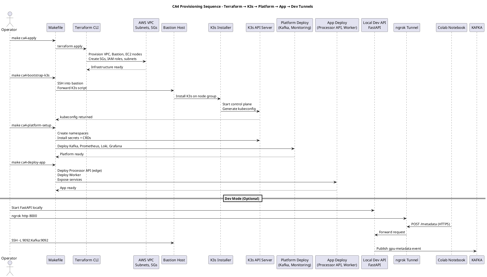

# **CA4 Provisioning Guide

### *End-to-End Provisioning Steps for the CA4 Multi-Cloud GPU → Streaming → Storage Pipeline*

---

# **1. Overview**

CA4 provisions a **multi-cloud ingestion and processing pipeline** that connects:

* **Google Colab GPU Runtime** → metadata producer
* **Local FastAPI Processor API** (for dev, exposed via **ngrok**)
* **AWS VPC** containing:

    * K3s Edge Cluster
    * Processor API (production)
    * Kafka brokers
    * Worker containers
    * DocumentDB + S3
    * Prometheus, Loki, Grafana
    * Bastion host for SSH tunneling and debugging

This document defines the **exact provisioning workflow**, aligned with the provided **Makefiles**, **Terraform modules**, and **deployment contracts** used by CA2/CA3—and now extended into CA4.

---

# **2. Provisioning Philosophy**

CA4 provisioning adheres to:

* **Idempotent Make targets**
* **Deterministic Terraform apply cycles**
* **Repeatable agent-friendly provisioning**
* **Isolated dev-mode (ngrok + SSH tunnels)**
* **Secure production mode (VPC-only networking)**

An agent (or human) must be able to:

1. Build the entire AWS VPC environment
2. Install K3s and bootstrap system namespaces
3. Deploy platform stack (Kafka, monitoring, data layer)
4. Deploy the CA4 application stack
5. Validate end-to-end ingestion (Colab → Kafka → Worker → DB/S3)

---

# **3. Provisioning Sequence Diagram **

Below is the **CA4 provisioning sequence** including:

* Terraform provisioning
* K3s installation
* Platform deployment
* Application deployment
* Observability stack
* Dev-mode tunnels / ngrok integration

---

### **PlantUML: Provisioning Sequence Diagram**



---

# **4. Detailed Provisioning Steps**

## **4.1 Step 1 — Provision AWS Infrastructure**

Run:

```bash
make ca4-apply
```

Outcome:

* VPC created (private + public subnets)
* Security groups for:

    * Bastion SSH
    * K3s nodes
    * Internal Kafka networking
* EC2 nodes for the K3s cluster
* Bastion host with IAM + SSH access

---

## **4.2 Step 2 — Bootstrap K3s Cluster**

Run:

```bash
make ca4-bootstrap-k3s
```

Steps performed:

1. SSH into bastion
2. Transfer K3s install scripts
3. Install K3s server on first node
4. Join additional nodes
5. Extract `kubeconfig` and save locally
6. Add TLS SAN for API server
7. Validate cluster health

---

## **4.3 Step 3 — Deploy Platform Layer (Platform Namespace)**

Run:

```bash
make ca4-platform-setup
```

This installs:

* Namespaces (`platform`, `monitoring`, `app`)
* Kafka StatefulSet (brokers, headless service, PVCs)
* Prometheus (scrape configs, exporters)
* Loki + Promtail (log shipping)
* Grafana (port-forward ready)
* Secrets (Kafka SASL none, internal-only)
* Monitoring CRDs and RBAC

Cluster now contains the foundational CA4 system.

---

## **4.4 Step 4 — Deploy Application Layer (Processor API + Worker)**

Run:

```bash
make ca4-deploy-app
```

This deploys:

### **Processor API (Edge)**

* FastAPI Deployment
* Service inside the VPC
* Exposes `/metadata` ingress for Colab → VPC POSTs

### **Metadata Worker**

* Kafka consumer
* Parses + transforms metadata
* Writes to DocumentDB
* Optionally archives to S3

After this step:

> AWS VPC + K3s stack is fully live.

---

## **4.5 Step 5 — Local Development Mode (Optional)**

### **Run FastAPI locally**

```bash
uvicorn server:app --host 0.0.0.0 --port 8000
```

---

### **Expose it using ngrok for Colab**

```bash
ngrok http 8000
```

Set the ngrok URL in Colab:

```python
EDGE_API_URL = "https://YOUR_NGROK_URL.ngrok-free.app"
```

Colab → your laptop now works.

---

### **Create SSH tunnel for Kafka access**

```bash
ssh -i key.pem \
    -L 9092:kafka-0.kafka-svc.platform.svc.cluster.local:9092 \
    ec2-user@<BASTION_PUBLIC_IP>
```

This maps:

```
localhost:9092 → Kafka broker inside VPC
```

Local Processor API can now publish events to Kafka:

```python
KafkaProducer(bootstrap_servers=["localhost:9092"])
```

---

# **5. End-to-End Validation**

Run:

```bash
make ca4-verify-e2e
```

Validation performs:

1. Colab sends test payload
2. Processor API receives it
3. Kafka receives event
4. Worker processes it
5. DB contains new metadata record
6. Prometheus metrics updated
7. Grafana shows ingestion
8. Loki receives logs from Processor + Worker

The system is now fully operational.

---

# **6. Deprovisioning**

Run:

```bash
make ca4-destroy
```

This removes:

* VPC
* Bastion
* EC2 nodes
* Security groups
* S3 buckets (optional flag)

---

# **7. Notes for Agents**

This document is formatted so an autonomous agent can:

* Parse provisioning responsibilities
* Map Make targets to actionable sequences
* Follow the ingested diagrams and architecture
* Execute AWS + Kubernetes operations safely
* Validate all success conditions

The **CA4 pipeline is fully agent-operable**.

