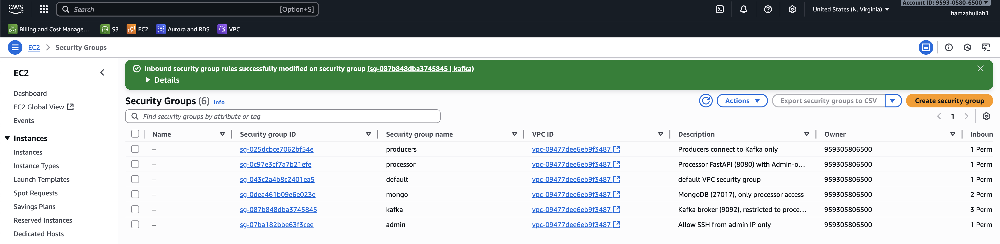
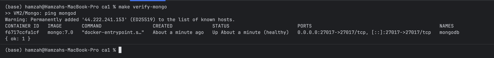
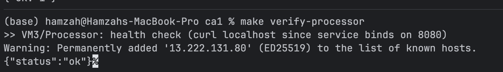
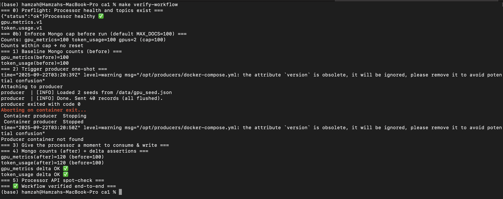

# gpu-token-analytics-pipeline
Analytics pipeline and course artifacts for GPU &amp; token-usage experiments—assignments, diagrams, and reports for CS5287.

## Course Assignments Overview

This repository contains documentation and artifacts for CS5287 course assignments (CA0–CA4), demonstrating the evolution of a GPU token analytics pipeline from manual deployment to enterprise-scale multi-site architecture.

**Core Pipeline**: Producers → Kafka → Processor → MongoDB  
**Use Case**: Track GPU metrics and token throughput; compute cost_per_token and store analytics data.

## File Structure

```
gpu-token-analytics-pipeline/
├── CA0/
│   ├── README.md
│   ├── aws-vm-setup-instructions.md
│   ├── diagrams/
│   │   ├── architecture.puml
│   │   └── hardware-architecture.puml
│   ├── docs/
│   │   ├── architecture.md
│   │   ├── architecture-tradeoffs.md
│   │   └── conversation-summary.md
│   ├── schemas/
│   │   ├── gpu.metrics.v1.json
│   │   └── token.usage.v1.json
│   ├── screenshots/
│   │   └── ...
│   ├── demo/
│   │   └── smoke-test.sh
│   ├── vm1-kafka/
│   │   ├── docker-compose.yml
│   │   ├── config/
│   │   │   └── server.properties
│   │   └── README.md
│   ├── vm2-mongo/
│   │   ├── docker-compose.yml
│   │   ├── config/
│   │   │   └── init-scripts/indexes.js
│   │   └── README.md
│   ├── vm3-processor/
│   │   ├── docker-compose.yml
│   │   ├── Dockerfile
│   │   └── app/
│   │       ├── main.py
│   │       └── requirements.txt
│   └── vm4-producers/
│       ├── docker-compose.yml
│       ├── Dockerfile
│       ├── producer.py
│       ├── gpu_seed.json
│       └── requirements.txt
├── CA1/
│   ├── README.md
│   ├── CA1-step-by-step-guide.md
│   ├── docs/
│   │   ├── architecture.md
│   │   ├── architecture-tradeoffs.md
│   │   └── conversation-summary.md
│   ├── diagrams/
│   │   ├── architecture-final.puml
│   │   └── provisioning-sequence-final.puml
│   ├── screenshots/
│   │   └── ...
│   ├── terraform/
│   │   ├── Makefile
│   │   ├── main.tf
│   │   ├── variables.tf
│   │   ├── outputs.tf
│   │   ├── providers.tf
│   │   ├── terraform.tfvars
│   │   ├── terraform.tfvars.example
│   │   ├── terraform.tfstate
│   │   ├── terraform.tfstate.backup
│   │   ├── modules/
│   │   │   ├── vpc/
│   │   │   ├── security_groups/
│   │   │   ├── network/
│   │   │   └── instances/
│   │   │       └── templates/
│   │   └── tfplan
│   └── Makefile
├── CA2/
│   ├── README.md
│   ├── architecture.md
│   └── conversation-summary.md
├── CA3/
│   ├── README.md
│   ├── architecture.md
│   └── conversation-summary.md
├── CA4/
│   ├── README.md
│   ├── architecture.md
│   └── conversation-summary.md
├── README.md
└── infracost_test.tf
```

### Assignment Progression

- **[CA0 — Manual Deployment on 4 VMs](#ca0-build-and-verify-the-pipeline-by-hand)**  
  Manual provisioning, SSH hardening, basic pipeline validation.

- **[CA1 — IaC Rebuild (Same Topology, Automated)](CA1/README.md)**  
  Infrastructure as Code with Terraform/Ansible, idempotent deployment.

- **[CA2 — Orchestrated (Kubernetes/Swarm)](CA2/README.md)**  
  Container orchestration with StatefulSets, Deployments, and Services.

- **[CA3 — Cloud-Native Ops](CA3/README.md)**  
  Observability, autoscaling, security policies, and resilience testing.

- **[CA4 — Multi-Site Connectivity & Advanced Networking](CA4/README.md)**  
  Service mesh, cross-region replication, and disaster recovery.

Each assignment includes architecture diagrams (PlantUML), replication steps, and conversation summaries documenting decisions and tradeoffs.

---

## CA0 — Build and Verify the Pipeline “by hand”

Goal: Provision 4 VMs, install services, wire data flows, enforce basic security, and document everything end-to-end.

Authoritative references for CA0:
- Architecture and sizing: CA0/docs/architecture.md
- AWS Console setup guide: CA0/aws-vm-setup-instructions.md

### 1) Software Stack (Reference)
- Pub/Sub: Apache Kafka 3.7.0 (KRaft or ZooKeeper local-only)
- Database: MongoDB 7.0
- Processor: Python FastAPI service (Uvicorn), reads NVML/SMI or gpu_seed.json; computes cost_per_token
- Producers: Python (confluent-kafka)
- Container runtime (where applicable): Docker

Configuration Summary (components, versions, hosts, ports):

| Component | Image/Version | Host (VM) | Listen/Target Port |
|---|---|---|---|
| Kafka | bitnami/kafka:3.7 (or native 3.7.0) | VM1 | 9092 |
| MongoDB | mongo:7.0 | VM2 | 27017 |
| Processor | FastAPI (Python 3.12) | VM3 | 8080 (optional) |
| Producers | Python + confluent-kafka 2.5 | VM4 | → VM1:9092 |

See also: CA0/docs/architecture.md for logical and hardware diagrams and port mappings.

### 2) Environment Provisioning (AWS example)
- Cloud: AWS, single VPC with one public subnet (10.0.1.0/24)
- 4 EC2 instances (≈2 vCPU, 4 GB RAM recommended for Kafka/Mongo)
- Record VM names, private IPs, and SG assignments (examples in CA0/aws-vm-setup-instructions.md)

Key console milestones (screenshots):
- SSH Keypair
  
  
  
  
  
  
- Networking
  
  
  
  
  
  
  
  
  
  
- Instances
  
  
  
  
  
  

### 3) Software Installation & Configuration
- VM1 Kafka: install and expose 9092 to private subnet; create topic tokens (12 partitions)
  
  
- VM2 MongoDB: install 7.0; bind to private IP; expose 27017 to Processor only
  
  
- VM3 Processor: run the processor container; env vars:
  - KAFKA_BOOTSTRAP=VM1_PRIVATE_IP:9092
  - KAFKA_TOPIC=tokens
  - MONGODB_URI=mongodb://VM2_PRIVATE_IP:27017/ca0
  - PRICE_PER_HOUR_USD=0.85 (example)
  - GPU_METRICS_SOURCE=nvml|nvidia-smi|seed
  
  
- VM4 Producers: run 1–2 producer containers to publish messages
  
  

### 4) Data Pipeline Wiring & Verification
- Create Kafka topic tokens with 12 partitions
- Start producers → verify messages in Kafka
- Start processor → consumer group assigns partitions; processor writes to MongoDB (collections: gpu_metrics, token_usage)
- Push sample messages and verify DB entries exist
  
  
  
  

### 5) Security Hardening
- Disable password login; SSH key-only (PasswordAuthentication no)
- Security Groups (SG):
  - Kafka (VM1): allow 9092 from Processor (VM3) and Producers (VM4) only
  - MongoDB (VM2): allow 27017 from Processor (VM3) only
  - Processor (VM3): 8080 from Admin IP only (optional)
- On-box UFW to mirror SGs
- Run containers as non-root where supported

### 6) Deliverables Checklist (what to include in CA0)
- VM specs: size, OS, private IPs (list in README table)
- Image tags and versions used
- High-level step list or commands captured
- Network Diagram: link to CA0/docs/architecture.md (logical + hardware diagrams)
- Configuration Summary table (above)
- Demo Video (1–2 min): run producer, show Kafka topic activity, show processor logs, verify MongoDB record
- Screenshots of milestones (see paths above)
- Any deviations from the reference stack and rationale

### 7) Grading Mapping (how this README satisfies rubric)
- Correctness & Completeness: all four stages installed, wired, and verified
- Security Controls: SSH keys only, minimal ports, non-root containers when possible
- Documentation & Diagrams: this README + CA0/docs/architecture.md
- Demo Quality: concise 1–2 minute recording of e2e flow
- Cloud-Modality: AWS console steps documented with screenshots
- Reproducibility: concrete versions, env vars, and commands

### 8) Reproduction Steps (quickstart)
1. Follow CA0/aws-vm-setup-instructions.md to create VPC, SGs, and 4 VMs; record private IPs.
2. On VM1: install/start Kafka 3.7 and create topic tokens with 12 partitions.
3. On VM2: install/start MongoDB 7.0 and create DB ca0.
4. On VM3: deploy processor container with env vars pointing to VM1/VM2.
5. On VM4: run producer containers to send messages to tokens.
6. Verify end-to-end and capture logs; enforce SSH key-only and UFW rules.

For detailed commands and make targets, also see: CA0/README.md.

---

Notes
- All links and images above use local repository paths to avoid external breakage.
- For full architecture details (ports, autoscaling heuristics, partitioning guidance), read CA0/docs/architecture.md.

## CA1 — IaC Rebuild (Terraform-Based Deployment)

Goal: Recreate CA0’s 4-VM topology using Infrastructure as Code (Terraform + cloud-init) with idempotent provisioning, minimal manual steps, and repeatable teardown.

Authoritative references for CA1:
- CA1 overview: CA1/README.md
- Architecture and sequence diagrams: CA1/docs/architecture.md
- Step-by-step guide: CA1/CA1-step-by-step-guide.md

### 1) Software Stack (Reference)
- Same logical pipeline as CA0: Producers → Kafka → Processor → MongoDB
- Runtime: Docker + Compose installed via cloud-init on each VM
- Topics (typical): gpu.metrics.v1, token.usage.v1

Configuration Summary (components, versions, hosts, ports):

| Component | Image/Version | Host (VM) | Listen/Target Port |
|---|---|---|---|
| Kafka | bitnami/kafka:3.7 (or native 3.7.0) | VM1 | 9092 |
| MongoDB | mongo:7.0 | VM2 | 27017 |
| Processor | FastAPI (Python 3.12) | VM3 | 8080 |
| Producers | Python + confluent-kafka 2.5 | VM4 | → VM1:9092 |

See also: CA1/docs/architecture.md for the IaC-based logical and sequence diagrams.

### 2) Environment Provisioning (Terraform)
Prereqs (local): Terraform ≥ 1.6, AWS CLI v2 configured, existing EC2 key pair, jq, curl.

1. Prepare variables (recommended):
   - Copy CA1/terraform/terraform.tfvars.example to CA1/terraform/terraform.tfvars and set:
     - ssh_key_name = "<your-ec2-keypair-name>"
     - my_ip_cidr   = "x.x.x.x/32" (or let Makefile auto-detect MY_IP_CIDR)
     - Optionally adjust region/profile and CIDRs.

   Example terraform.tfvars (minimal):
   
   ```hcl
   project_name = "ca1"
   aws_profile  = "terraform"
   aws_region   = "us-east-1"
   ssh_key_name = "my-ec2-keypair"
   my_ip_cidr   = "203.0.113.25/32"
   public_subnet = true
   ```

2. Deploy infrastructure:
   
   ```bash
   cd CA1/terraform
   make deploy         # terraform init + plan + apply (auto-injects my_ip_cidr)
   ```

   Screenshot milestones:
   
   - Terraform init
     
     
   
   - Terraform apply
     
     
   
   - Terraform outputs
     
     

3. Inspect resources:
   - CLI: `make outputs` (VPC/subnet IDs and instance IPs)
   - Console: verify EC2 instances are created and running
     
     
     
     

Notes:
- The Terraform Makefile honors AWS_PROFILE and AWS_REGION; override as needed.
- Security groups restrict access based on my_ip_cidr; use a bastion or enable public IPs if private-only.

### 3) Software Installation & Configuration (Automated)
- Cloud-init templates (CA1/terraform/modules/instances/templates/) install Docker and run components per VM:
  - vm1-kafka.cloudinit.tftpl → Kafka broker (topics created idempotently if included)
  - vm2-mongo.cloudinit.tftpl → MongoDB 7.0 (with indexes/collections as needed)
  - vm3-processor.cloudinit.tftpl → FastAPI processor (env points to Kafka/Mongo private IPs)
  - vm4-producers.cloudinit.tftpl → Producers sending metrics/usage events
- Private networking is used for service-to-service traffic; ports are limited by SGs.

### 4) Data Pipeline Wiring & Verification
Use the CA1 root Makefile (reads Terraform outputs) to validate services end-to-end.

- cd CA1
- make addrs          # show private/public IPs
- make env            # print KAFKA_BOOTSTRAP / MONGO_URL / PROCESSOR_HEALTH using private IPs
- make verify         # runs verify-kafka, verify-mongo, verify-processor, verify-producers
- make verify-workflow MAX_DOCS=100  # optional, runs an end-to-end smoke with caps

Sample outputs:

```bash
$ make env
export KAFKA_BOOTSTRAP=10.0.1.101:9092
export MONGO_URL=mongodb://10.0.1.102:27017/ca0
export PROCESSOR_HEALTH=http://10.0.1.103:8080/health

$ make verify
>> VM1/Kafka: listing topics ...
__consumer_offsets
gpu.metrics.v1
token.usage.v1
>> VM2/Mongo: ping mongod
{ ok: 1 }
>> VM3/Processor: health check ...
{"status":"ok"}
>> VM4/Producers: recent logs ...
...
```

Verification screenshots:

- Kafka topics list

  

- Mongo verification (ping/indexes)

  

- Processor health

  

- End-to-end workflow (before/after counts)

  

  

Internals:
- Terraform outputs include instance_private_ips and instance_public_ips used by the Makefile.

### 5) Security Hardening
- SSH key-only; Security Groups restrict:
  - 22/tcp to my_ip_cidr
  - 9092/tcp (Kafka) to internal producers/processor only
  - 27017/tcp (Mongo) to processor only
  - 8080/tcp (Processor) optionally to my_ip_cidr for admin/testing
- Containers run with least privilege where supported.

### 6) Deliverables Checklist (what to include in CA1)
- terraform.tfvars (with secrets redacted) and Makefile overrides used
- Terraform plan/apply evidence (tfplan retained, screenshots/logs)
- Terraform outputs and resulting private/public IPs
- Architecture/sequence diagrams: CA1/docs/architecture.md
- Short demo: verify-workflow run showing producer → Kafka → processor → MongoDB writes
- Any deviations from CA0 stack and rationale

### 7) Grading Mapping
- Correctness & Completeness: infra created via IaC, services running, E2E verified
- Security Controls: my_ip_cidr gate, minimal ports, SSH keys only
- Documentation & Diagrams: this README section + CA1/docs/architecture.md + CA1/README.md
- Demo Quality: concise capture of verify/verify-workflow
- Reproducibility: Terraform state, tfvars, versions, and Makefile commands

### 8) Reproduction Steps (quickstart)
1. cd CA1/terraform && cp terraform.tfvars.example terraform.tfvars && edit values
2. make deploy && make outputs
3. cd .. && make addrs && make verify
4. Optional: make verify-workflow MAX_DOCS=100
5. Teardown: cd terraform && make down

Teardown evidence:

```bash
cd CA1/terraform
make down
```


