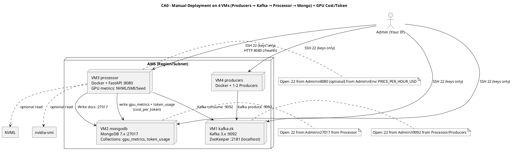

# CA0 – Manual Deployment on 4 VMs with GPU Cost/Token Use Case

Context
- Manually provision 3–4 VMs, install services, wire the pipeline, secure ports, and validate end-to-end.
- Chosen cloud: AWS (t3a.medium x4) or equivalent VMs. Local setups acceptable; topology remains identical.

Diagram (PlantUML)

Replication (high-level)
- Provision 4 VMs (≈2 vCPU, 4 GB) in one subnet.
- Secure SSH (PasswordAuthentication no; key-only), ufw mirror SGs.
- Install Kafka+ZooKeeper on VM1 (systemd), MongoDB on VM2, Docker on VM3/VM4.
- Run processor container on VM3 (Kafka consumer, reads GPU metrics or seed JSON, computes cost_per_token, writes to MongoDB).
- Run 1–2 producer containers on VM4 (publish token events to Kafka).
- Verify: produce → topic → processor → MongoDB documents (gpu_metrics, token_usage).