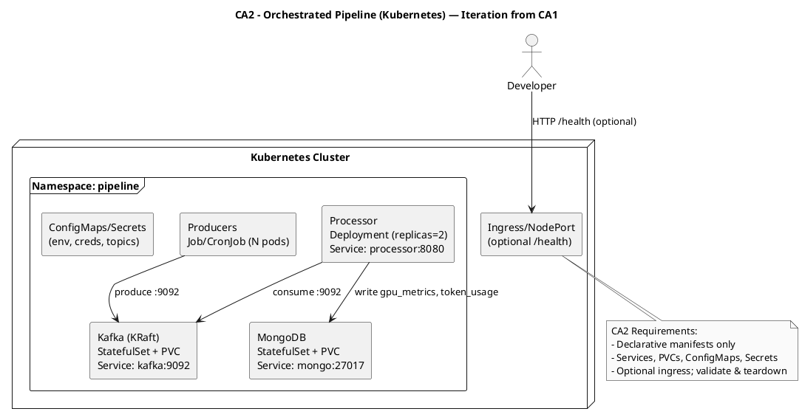

# CA2 – PaaS Orchestration (Kubernetes or Swarm)

Context
- Run the CA0 pipeline on an orchestrator using declarative manifests. Example: Kubernetes with KRaft Kafka.

Diagram (PlantUML)

Replication (high-level)
- kubectl apply -f k8s/: namespace, Secrets/ConfigMaps, Kafka SS, Mongo SS, Processor Deployment, Producers Job.