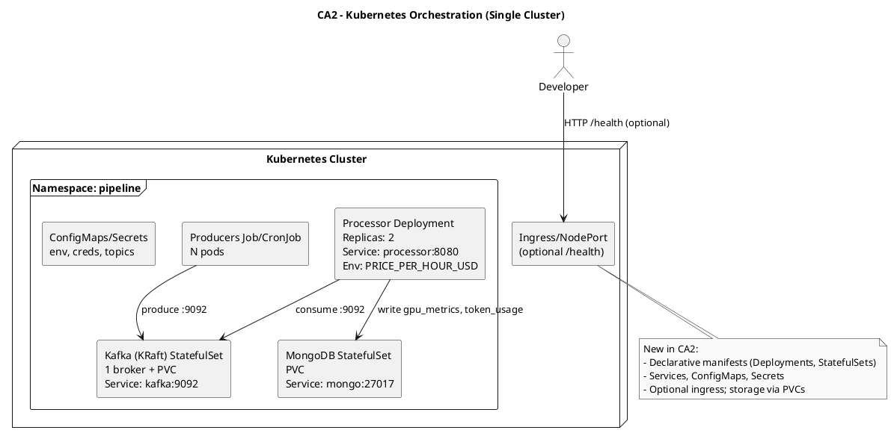

# CA2 – PaaS Orchestration (Kubernetes or Swarm)

Context
- Declarative manifests on a single Kubernetes cluster.

Diagram (PlantUML)

Replication (high-level)
- Apply manifests; verify pods, services, PVCs; check Mongo docs.