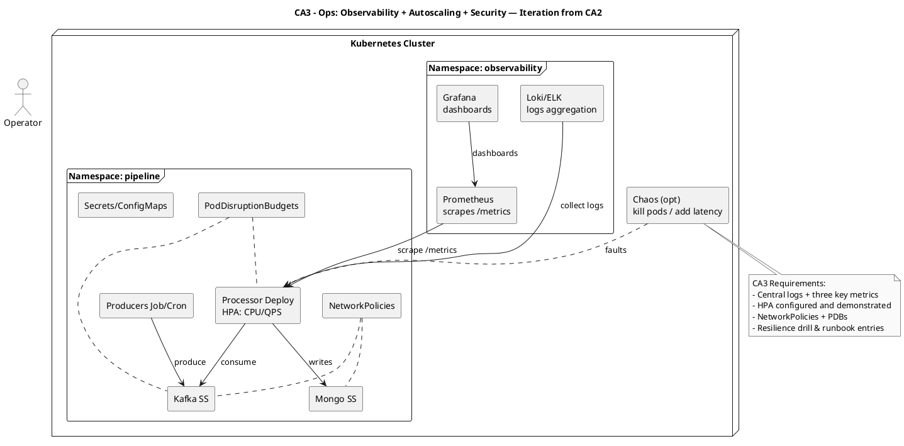

# CA3 – Cloud-Native Ops (Observability, Autoscaling, Security, Resilience)

Context
- Enhance the CA2 cluster with ops features: logs/metrics, dashboards, autoscaling, network policies, disruption budgets, chaos drills.

Diagram (PlantUML)

Replication (high-level)
- Deploy Prometheus/Grafana/Loki; expose /metrics; configure HPA, NetPols, PDBs; execute a chaos drill and document recovery.