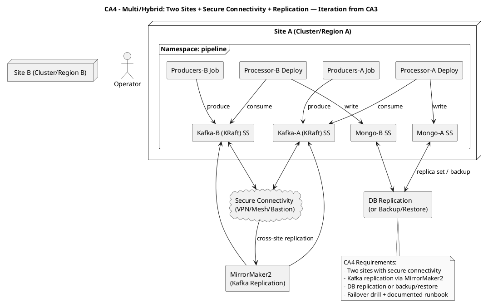

# CA4 – Multi-Hybrid Cloud (Final)

Context
- Extend CA2 across two sites/clouds with secure connectivity and replication; prove resilience and document a runbook.

Diagram (PlantUML)

Replication (high-level)
- Establish connectivity, deploy to both sites, configure MM2 and DB strategy, run failover drill and document recovery.